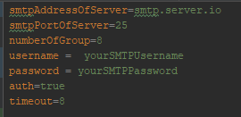

# Teaching-HEIGVD-RES-2019-Labo-SMTP

Authors : Florian Polier && Crescence Yimnaing

Date : 10.04.2019

Brief : This project is a lab from academic course "RES" in HEIG-VD. 
The goal is to send semi-random pranks by mails to configured address. 
To do so, we implement our own SMTP Client.

----

## Instructions for setting up a mock SMTP server (with Docker)
In order to test our tool before sending real mails, you can easily set up a fake SMTP server.
Here are instructions to do so, with MockMock Server (see refs) on Docker :

### Prerequisite
- Docker
- Internet connexion
1) Get MockMock jar file (see ref)
2) Create your Docker image. Create a file named Dockerfile with this content: 
```
FROM openjdk:8-jre-alpine
# copy JAR into image
COPY MockMock.jar /MockMock.jar
# run application with this command line
CMD ["/usr/bin/java", "-jar", "/MockMock.jar", "-p", "yourSMTPPort", "-h", "yourHTTPPort"]
```
3) Build this image with the command `docker build --tag "repo:name" .`
4) Run a container based on this image with the command `docker run -p HTTPHostPort:HTTPContainerPort -p SMTPHostPort:SMTPContainerPort --name "MockMock" -d container_id`
Now, you should have access to your mockmock server via your browser on your IP address with correct port. Configure access info. in the config file and you're good to go!

## Clear and simple instructions for configuring your tool and running a prank campaign.

To run a prank campaign, you just have to :

- clone our repo
- compile it with `maven clean install`(root project folder)
- go in target/, take the jar file with launcher in its name
- copy it somewhere else where you want to launch the project from
- at the same level, create a `Configuration` folder with this tree        
configuration must follow these guidelines:  
`victims`  
  
  
`message`  


`properties`
  In the properties files you may find some interesting settings. `Timeout` allows you to set (sec) a timeout between each mail to avoid getting blacklisted.  `auth` (true|false) tells to the client if it should try to authentificate to SMTPServers. `numberOfGroup` tells to the client how many groups the victims should be sorted in. Remember that your groups must contain at least 3 person (2 victims and 1 sender)


## A description of your implementation

  We have separate our code into 2 principals package. ```mail``` and ```utils```.  
  `utils` contains tool code for authentification. 
  the mail package contains three packages:
  
  ```config```
  
- IConfigurationManager : is the interface of configurations that is implemented by ConfigurationManager.
- ConfigurationManage: The main rule of is to parse configuration files, so that we will obtain list of our victims, jokes and information about the server.
  
    
    


  
  ```model/mail```
  
- Group : a group of persons(sender and menbers).
- Mail  : mail by the sender, the recipients , Subject, text, etc...
- Person: he is defined by his address mail.

    

    
 ```model/prank```
 
- Prank: represents the body of a mail (suject, content).
- PrankGenerator.java: this class is used to form groups, generate mails, by reading the config files, create a SMTPClient, choose randomly a prank, call sendMail on client with each created mail.

    
  
  ```smtp```
  
- ISMTPClient.java: is the interface of the client smtp that bind it to implement a "sendMail" method, this interface also contains methods to send and receive data from a SMTP server.
- SMTPClient.java: represents the SMTP client which implements the interface ISmtpClient, this class allows to send emails, and detect which auth. method it should use, based on RFC. Only SMTP Commands are allowed to be sent to the server. 

    

##
## References

* [MockMock server](<https://github.com/tweakers/MockMock>) on GitHub
* The [mailtrap](<https://mailtrap.io/>) online service for testing SMTP
* The [SMTP RFC](<https://tools.ietf.org/html/rfc5321#appendix-D>), and in particular the [example scenario](<https://tools.ietf.org/html/rfc5321#appendix-D>)
* Testing SMTP with TLS: `openssl s_client -connect smtp.mailtrap.io:2525 -starttls smtp -crl`

